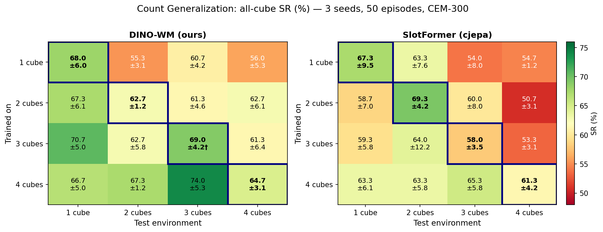

# Cube Count Generalization

Does a world model trained on N cubes generalize to planning with M ≠ N cubes?

## Setup

- **Models**: DINO-WM (ours, patch-grid DINO features) vs SlotFormer (cjepa, object-centric slots)
- **Training**: one model per cube count (1/2/3/4), each trained on its own expert dataset
- **Evaluation**: 4×4 matrix — every model × every test environment
- **Protocol**: CEM-300, 50 episodes, seeds 0/1/2, SR = fraction where **all** cubes reach goal (≤ 0.04 m)

## Results

*Diagonal (navy border) = in-distribution. Values: mean ± std across 3 seeds. †n=2 seeds.*

### Full table (DINO-WM / SlotFormer)

| Train \ Test | 1 cube | 2 cubes | 3 cubes | 4 cubes |
|---|---|---|---|---|
| **1 cube**  | **68.0±6.0** / 67.3±9.5 ◀ | 55.3±3.1 / **63.3±7.6** | **60.7±4.2** / 54.0±8.0 | **56.0±5.3** / 54.7±1.2 |
| **2 cubes** | **67.3±6.1** / 58.7±7.0   | 62.7±1.2 / **69.3±4.2** ◀ | **61.3±4.6** / 60.0±8.0 | **62.7±6.1** / 50.7±3.1 |
| **3 cubes** | **70.7±5.0** / 59.3±5.8   | 62.7±5.8 / **64.0±12.2** | **69.0±4.2†** / 58.0±3.5 ◀ | **61.3±6.4** / 53.3±3.1 |
| **4 cubes** | **66.7±5.0** / 63.3±6.1   | **67.3±1.2** / 63.3±5.8   | **74.0±5.3** / 65.3±5.8   | **64.7±3.1** / 61.3±4.2 ◀ |

**Bold** = winner by >0.5pp. ◀ = in-distribution diagonal.

DINO-WM wins **12/16 cells**. SlotFormer wins only on test=2 cubes for train=1/2/3.

## Key findings

**DINO-WM matches or exceeds SlotFormer on 12/16 cells**, despite using no object-centric
structure. The advantage grows with cube count: DINO-WM is clearly better on 3- and 4-cube
tasks, while SlotFormer has a small edge on 2-cube evaluation when trained on ≤3 cubes.

**Training on more cubes helps.** Train=4 is the strongest DINO-WM config across all test
environments — it reaches 74.0% on 3-cube OOD and 67.3% on 2-cube, the best in each column.
SlotFormer does not show the same monotonic benefit from harder training counts.

**Count generalization is robust for both models.** Train=1 → test=4 gives 56% (DINO-WM) and
55% (SlotFormer), only ~9–10pp below in-distribution. The first cube is always solved (SR_ge1 ≈ 100%);
the bottleneck is the last cube.

**DINO-WM has lower variance.** Most cells show tighter ±std, especially test=2 (±1.2 vs ±4.2
for in-distribution double), suggesting more stable planning in patch-feature space.

## Methodology notes

| | DINO-WM (SWM) | SlotFormer (cjepa) |
|---|---|---|
| Features | DINO ViT-S/8 patch grid, 224px | Frozen SC encoder, 7 slots, 256px |
| Planning | CEM-300, horizon=5, receding=5, action_block=5 | CEM-300, same + goal-weighted slot filter |
| Eval budget | 50 planning calls (same) | 50 planning calls (same) |
| Eval split | full dataset | train split (~2500 eps) |

The comparison is approximately matched on compute budget (same eval_budget, same CEM samples,
same horizon/receding_horizon/action_block). The main structural difference: cjepa applies
`+slot_filter=goal_weighted` during CEM — an explicit mechanism that re-weights slots by goal
relevance to help SlotFormer focus on the right objects. DINO-WM has no equivalent and still
wins on 12/16 cells.

## Model parameters

| Component | DINO-WM | SlotFormer |
|---|---|---|
| Visual backbone (frozen) | 22.1M (DINO ViT-S/8) | 22.0M (SC ViT-S, in SC encoder ckpt) |
| **Trained WM dynamics** | **23.2M** | **3.7M** (3.2M predictor + 0.5M slot attention) |
| Total at inference | 45.3M | 28.8M |

The visual backbone runs **once per receding-horizon step** (every 5 env steps) to encode the
new real observation into a latent. Everything inside CEM — 300 candidate sequences × 5 imagined
steps = 1500 forward passes — uses only the **predictor**. So the backbone cost is negligible;
the dynamics model is the bottleneck.

DINO-WM's predictor is **6× larger** (23.2M vs 3.7M) because it operates on the full patch grid
(~784 tokens at 224px). SlotFormer compresses each frame to 7 slots × 128-dim = 896 values,
making its dynamics model cheap but potentially lossy. The comparison is not parameter-matched
at the WM level — DINO-WM's advantage may partly reflect its larger dynamics capacity, not just
the patch-vs-slot representation choice.
