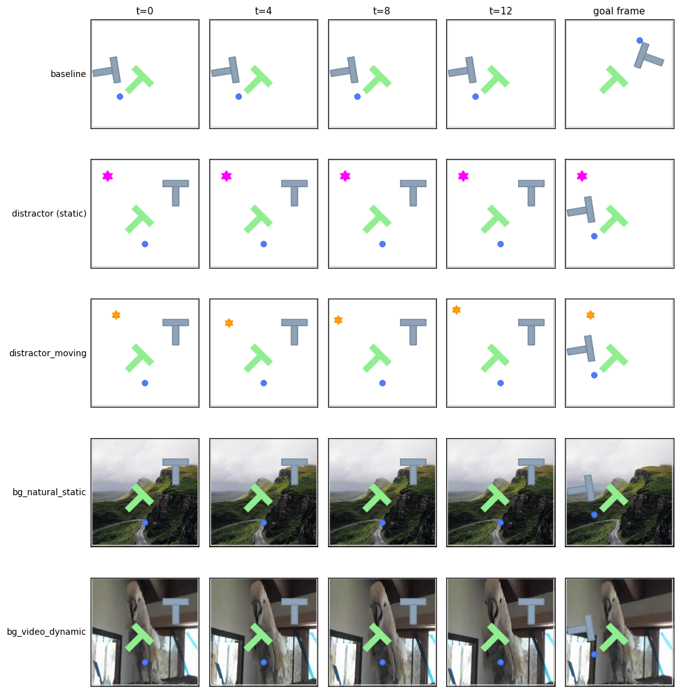
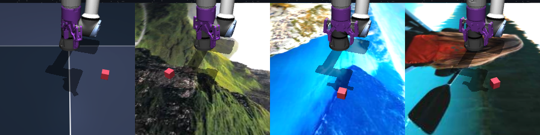

# Dynamic OOD cells (DCS-style) — handoff for running on CJEPA

Audience: the session that will run SlotContrast-WM / LeWM through the cjepa
planning pipeline on the new PushT perturbation cells. Everything here lives
on the stable-worldmodel branch **`ood-dynamic-distractors`** (cut from
`pusht-multi`; contains all OOD eval fixes incl. the cube goal-frame fix
`1f552ef`). Use this branch for the SWM checkout that cjepa imports.



Rows: baseline, static distractor (legacy cell), **distractor_moving**,
**bg_natural_static**, **bg_video_dynamic**. Columns: env steps t=0..12 under
zero actions + the goal frame the planner receives. Note the dynamic cells
change *during* the rollout while the goal frame stays frozen.

## What changed in the PushT env (`stable_worldmodel/envs/pusht/env.py`)

1. **`distractor.motion`** — Box `(amplitude_px, period_steps)`, init `(0, 40)`.
   The (visual-only, collision-free) distractor moves on a circle of radius
   `amplitude` around `distractor.position`, advancing one phase step per env
   step. Cosine phase ⇒ the amplitude already offsets the distractor at t=0,
   so start/goal frames reflect the cell. `amplitude=0` = legacy static.

2. **`distractor.shape`** — Discrete: 0=square (legacy), 1=triangle,
   2=**star (default)**, and the default distractor color is now dark
   orange. Both chosen so the distractor resembles neither the agent (blue
   disk) nor the block (slate-gray T): if a slot model still misbinds it
   into a task slot, that is a genuine binding failure, not an artifact of
   look-alike shapes. The legacy gray square is reproducible with
   `distractor.shape=0, distractor.color=[128,128,128]`.

3. **`background.texture_id`** — Discrete 0..16, init 0 (= plain background
   color). A value k≥1 selects the k-th sorted entry of the texture dir:
   an image **file** is a static background; a **directory** of frames is a
   clip advancing one frame per env step (looping). Drawn behind
   goal-marker/block/agent. A missing texture **raises** (no silent no-op).

## What changed in the Cube env (`stable_worldmodel/envs/ogbench/cube_env.py`)

**`floor.texture_id`** — same indexing contract as PushT: a static image file
replaces the procedural checker floor (recompiles the model; `texture_dir`
kwarg / `$SWM_TEXTURE_DIR` resolution shared via
`stable_worldmodel.envs.utils.resolve_texture_entry`). **Static images only —
clip dirs raise** `NotImplementedError` until per-step MuJoCo texture upload
is wired. MuJoCo accepts **PNG only** (the fetch script stores PNG).



Texture dir resolution: `texture_dir` env kwarg → `$SWM_TEXTURE_DIR` → swm
cache `~/.stable_worldmodel/textures/`. Populate once with:

```bash
python scripts/data/fetch_textures.py --davis    # in stable-worldmodel
# 1: 01_mountains.png  2: 02_forest.png  3: 03_city.png    (static, picsum)
# 4: 04_cockatoo/      5: 05_newtonscradle/                 (clips, imageio)
# 6: 06_davis_bear/    7: 07_davis_dog/  8: 08_davis_car_roundabout/ (DAVIS)
```

Texture provenance: ids 1–5 are deterministic placeholders (picsum stock
photos + imageio sample videos); ids 6–8 are **DAVIS 2017** sequences — the
standard natural-video source in the visual-RL robustness literature
(DMControl-GB etc.). True DCS uses Kinetics-400, which is YouTube-ID
distributed and not reproducibly fetchable; DAVIS is the accepted stand-in.
The canonical dynamic cells use the DAVIS clips.

## Canonical cell definitions

All cells are **single-factor** (decision 2026-06-11) so the same definition
runs unmodified through cjepa's single-factor override runner and the SWM
launcher:

| cell | env | variation_values |
|---|---|---|
| `distractor_moving` | PushT | `distractor.motion=[40,20]` (unvaried leaves keep defaults: orange star, scale 20, position [80,80]) |
| `bg_natural_static` | PushT | `background.texture_id=1` |
| `bg_video_dynamic`  | PushT | `background.texture_id=6` (DAVIS bear — objects stay discernible) |
| `bg_video_camouflage` | PushT | `background.texture_id=8` (DAVIS car-roundabout — gray street nearly camouflages the gray T; extra-hard tier) |
| `floor_natural_static` | Cube | `floor.texture_id=1` |

(SWM-side launchers: `scripts/cluster/plan_ood/pusht.sh` cells 10–13,
`scripts/cluster/plan_ood/cube.sh` cell 15.)

## Running through cjepa

- All three cells run through the existing single-factor runner as-is:
  `variation.factor=distractor.motion variation.value=[40,20]`, resp.
  `variation.factor=background.texture_id variation.value=1` (or `4`).
  `background.texture_id` is an int — make sure the value is passed as an
  int, not a list (the runner's uint8-array coercion must not apply).
  Varying any `distractor.*` leaf enables the distractor; the unvaried
  leaves keep their defaults.
- Set `SWM_TEXTURE_DIR` in the job env and run `fetch_textures.py` once on
  the cluster before the `bg_*` cells.
- Export `SWM_EVAL_TRUST_CHECKS=1`: `evaluate_from_dataset` then verifies at
  reset that the planner's goal frame corresponds to the H5 goal state and
  that the success target matches the H5 (the cube-bug class fails loudly
  instead of producing plausible-but-wrong SRs). cjepa's pusht config already
  has the `_set_goal_state` callable, so the checks pass on a correct setup.

## Protocol notes

- **Frozen goal frame**: in `bg_video_dynamic`, the goal frame uses the clip
  frame current at goal-render time (t=0). The background then moves during
  the rollout while the goal background stays fixed — that mismatch is the
  point of the cell (task-irrelevant dynamic content), same as DCS.
- **Before interpreting model SRs**: run a random-policy floor for each new
  cell, and eyeball 2–3 rollout videos (goal panel vs live panel).
- Goal-row semantic: the eval goal is the state `goal_offset_steps − 1` steps
  after the start (chunk end is exclusive) — pinned by
  `tests/eval/test_ood_trust_chain.py::goal_row`.

## Sanity checks after switching the SWM checkout

```bash
uv run pytest tests/eval tests/envs/test_pusht_distractor_motion.py \
    tests/envs/test_pusht_background_texture.py -q     # ~10 s, all green
```

The trust suite's T6 sweep auto-covers every variation leaf, so if your SWM
checkout is on the wrong branch (no texture support) or the texture dir is
missing, these tests say so immediately.
